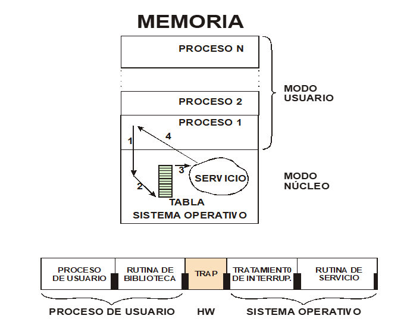
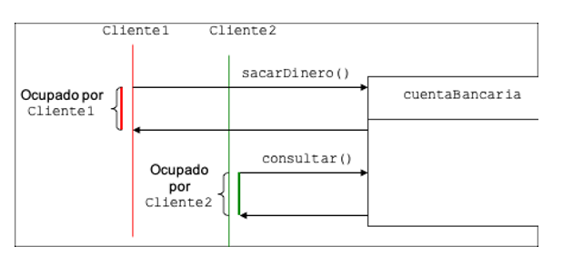
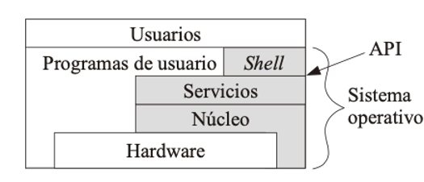

# Lab C Strings and Files

### Problem 1

Write a C function or POSIX that copies one file to another. The original name and the destination are parameters of the function. The destination file must have protections that allow it to be read by any user, but only to be modified by the owner.
Error conditions to be controlled:
Source file cannot be open.
Destination file cannot be created. 
Copy process did not finish well.

### Problem 2

Write a C program that opens a file, which name the student can give, checks that it exists and reads all its content and displays it on the screen.


### Problem 3: 

Write a program in C that for a number of students, which is requested by keyboard, asks for each one of them: name and 3 notes (which can have decimals). 
The program must create a file and write the data of each student in the file as they are read. 
Once the list of students has been entered, it calculates the average of the three grades for each student and displays the name and average grade of the student on the screen.


## Test

### Question 1

Which are the main functions of an operating system?

````
The operating system is a program that is responsible for covering the hardware to facilitate the use of the computer,
which it carries out by performing three main functions:

- Management of system resources.

- Execution of services for programs.

- Execution of programs by users.

````

### Question 2

Which of the following hardware mechanisms is not a requirement to build a multiprogrammed operating system with protection between users? Give reasons for your answer.

a.- Virtual memory.

b.- Memory protection.

c.- I / O instructions that can only be executed in kernel mode.

d.- 2 modes of operation: core and user.

````

The correct answer is a: Virtual Memory

Although it is necessary to have a large amount of main memory, this does not require the use of said service.

On the other hand, the remaining options are necessary.
````


### Question 3

What is the difference between a command and a system call?
````
A command is a program external to the operating system that allows users to interactively dialogue with 
the system through the shell or command interpreter.

System calls are a set of services that the operating system offers to programs that can be requested 
when needed.
They are called from external programs through system libraries, but the implementation of the system 
calls is internal to the operating system.

The set of system calls defines the services of the operating system.
````
### Question 4

How do you request a system call to the operating system?
```
It is requested through an interrupt mechanism. When requested by a running process, it uses a 
TRAP instruction that generates an interrupt. 
As shown in Figure, the TRAP interrupt handling routine uses an internal table of the S.O. to 
determine which routine to activate depending  on which call is requested.

When programmed in a high-level language, the request for services to the operating system is
made through a call to a specific function, which is responsible for generating the system call
and the corresponding trap.

```



### Question 5

Give some examples that show the need for the operating system to provide mechanisms for communication and synchronization between processes.

```
- Two processes that write to the same file.

Until one is finished, the other cannot begin: they must do it in an orderly manner. That is,
they must communicate with each other so that their writing operations do not overlap.

- Two processes that print on the screen.

If they did it at the same time, the information would be mixed. In this way there would be 
no synchronization between the processes.

- Two processes that manage the entry and exit of money
from a bank account.

If the process in charge of withdrawing money is running, the process that consults the 
balance must be synchronized with the first one and wait for it to finish before executing 
its balance inquiry function.

```



### Question 6

The command interpreter in LINUX in internal or external to the operating system?

Explain you answer.

```
The command interpreter in LINUX is external to the OS. It is call “Shell”

A good example is the case of LINUX, in which you can install as many command 
interpreters as you want. There are several installed in the system:

Bsh, csh, ksh, …

```


